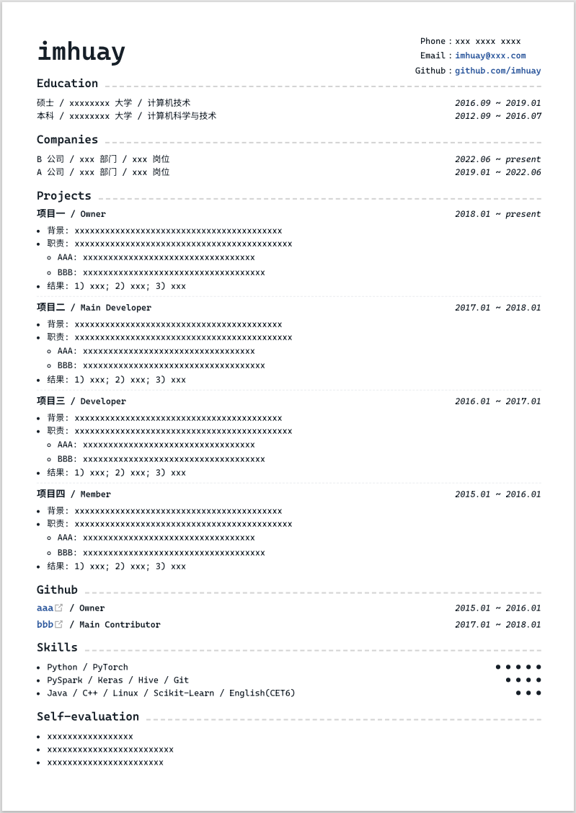

vuepress-theme-resume
===
> fork from: [komomoo/vuepress-theme-resume](https://github.com/komomoo/vuepress-theme-resume)

- [示例](#示例)
- [开始](#开始)
- [样式修改](#样式修改)
    - [本地开发](#本地开发)
    - [其他修改](#其他修改)
- [打印 / 导出为 PDF](#打印--导出为-pdf)
- [发布到 github-pages](#发布到-github-pages)


## 示例
> [vuepress-theme-resume/example](https://imhuay.github.io/vuepress-theme-resume/example/dist/)

配合等宽字体(Cascadia Mono)效果还可以
<div align="center">
  
</div>

## 开始

1. 安装 yarn
    > https://gist.github.com/imhuay/59b7f2676510b5b18882b5ad31793104#install-nodejs
    ```bash
    fnm=1.38.1
    node=v22.16.0
    yarn=v1.22.22
    ```
2. 安装依赖后运行
    ```bash
    cd path/to/vuepress-theme-resume
    yarn
    yarn dev
    ```
3. 填充简历: 直接编辑 `example/README.md`, 保存后网页将自动热更新


## 样式修改
> example/.vuepress/styles/palette.styl

```styl
// font
$fontSize = 12px
$fontWeight = 400

// colors
$accentColor = #4688F1
$textColor = #161F28
$borderColor = #eaecef
```

### 本地开发

如果有更多修改需求, 可以进行本地开发, 通过修改 `components/Page.vue` 来优化样式

```bash
# 修改 package.json
# {
#     "devDependencies": {
#         "vuepress-theme-resume": "file:./"
#     }
# }

# cd path/to/vuepress-theme-resume
yarn link  # 注册主题, 使支持实时更新

# 把项目链接到主题
# cd example  # 因为这里主题和项目是写在一个仓库下的, 所以直接在仓库根目录下 link 主题也可以
yarn link "vuepress-theme-resume" && yarn dev
# 此时修改 Page.vue 就可以实时生效了 (需要刷新网页)

# 开发完成后重新构建
yarn clean && yarn

# 解除链接 (可选)
yarn unlink

# 继续编辑简历或者发布
yarn dev
# yarn build  # 生成 example/dist
```

### 其他修改
1. 隐藏侧边栏
    > https://github.com/komomoo/vuepress-theme-resume/issues/17

    在默认打印设置下无影响, 但如果打印时想减小页边距, 则会出现, 所以最好隐藏 (默认打印下的页边距有点宽)
    
    方法: 注释掉 `example/.vuepress/config.js` 中的 `themeConfig.sidebar`
    ```js
    module.exports = {
        base: '/vuepress-theme-resume/example/dist/',
        dest: 'example/dist',
        theme: 'resume',
        themeConfig: {
            // sidebar: [
            //   {
            //     collapsable: true,
            //     children: ['/']
            //   }
            // ]
        }
    }
    ```

2. 修改字体

    通过修改浏览器字体实现 (以 Edge 浏览器为例), 进入 **设置 -> 外观 -> 字体 -> 自定义字体**
    
    推荐等宽字体, 我使用的是 `Cascadia Mono`.

    修改浏览器字体对大多数网页没有影响, 一般网页都会使用自己定义的字体

3. 创建自己的简历 (不在 example 上直接修改)

    ```bash
    cp -r example example-my

    # my-resume/.vuepress/config.js
    # module.exports = {
    #     base: '/vuepress-theme-resume/my/dist/',
    #     dest: 'my/dist',
    #     theme: 'resume',
    # }

    yarn devm
    ```


## 打印 / 导出为 PDF

右键 -> 打印 -> 另存为 pdf

打印设置
- 上下边距 3mm, 左右边距 4mm
- 取消页眉页脚


## 发布到 github-pages

```bash
# build
yarn build  # 生成 example/dist

# push
git add "example/dist" && git commit --amend -m "U" && git push -f
```