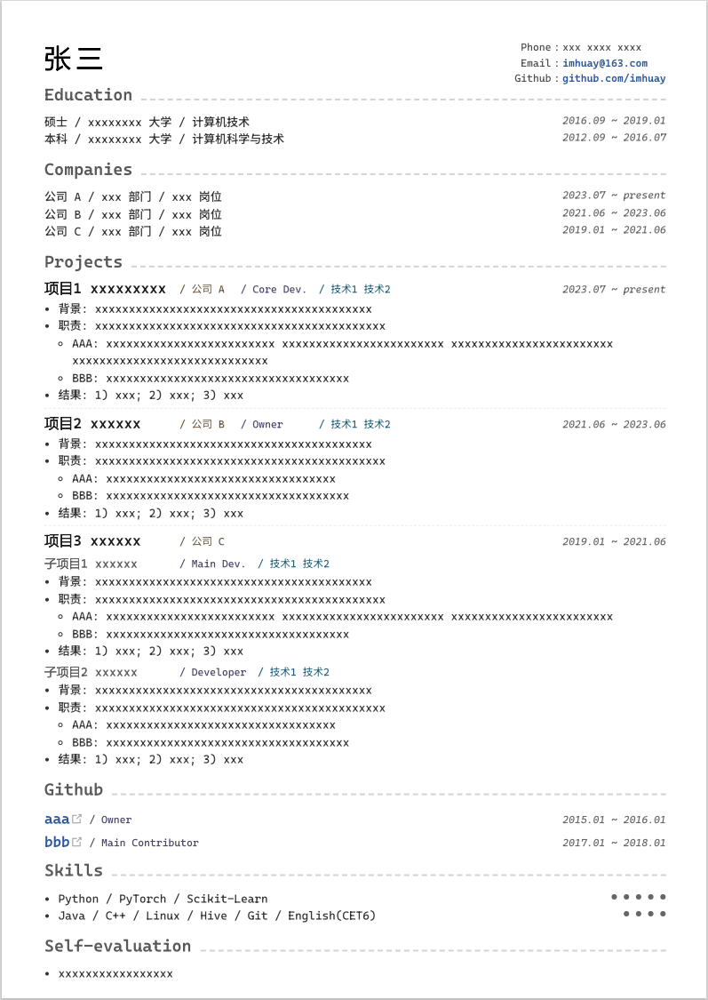

Markdown Resume
===
> fork from: [komomoo/vuepress-theme-resume](https://github.com/komomoo/vuepress-theme-resume)

- [示例](#示例)
- [开始](#开始)
    - [直接开始](#直接开始)
- [简单样式修改](#简单样式修改)
    - [样式覆盖](#样式覆盖)
    - [本地开发](#本地开发)
    - [其他修改](#其他修改)
- [打印 / 导出为 PDF](#打印--导出为-pdf)
- [发布到 github-pages](#发布到-github-pages)


## 示例
> [example/dist](https://imhuay.github.io/vuepress-theme-resume/example/dist/)

**注意**
- 简历在网页和 PDF 中的显示效果会因**字体**、**文字密度**和**行间距**等因素而差异巨大，需针对性调试才能达到最佳效果;
    - 以上影响因素均已参数化, 具体见 `styles/config.styl`;
- 以下展示的字体为 `Cascadia Mono` + `Noto Sans SC`, 这两种字体仅在 html 中有不错效果;
- **但实际打印时不如** `Consolas` + `Microsoft YaHei`;

<div align="center">
  
</div>

## 开始

### 直接开始


## 简单样式修改
> example/.vuepress/styles/palette.styl

> 若环境中不存在 `yarn`/`npm`，则需要先[安装yarn](https://yarnpkg.com/zh-Hans/docs/install)

```bash
# 安装依赖包
yarn # 或 npm i

# 开始
yarn dev # 或 npm run dev
```

`yarn dev`运行完后，使用浏览器打开提供的网址

3.  第三步：修改 example/README.md，保存后网页将自动热更新


### 样式覆盖

创建 .vuepress/styles/palette.styl 文件

```css
/* font */
$fontSize = 13px
$fontWeight = 400

// 完整的设置项见 styles/config.styl
```

### 本地开发

如果有更多修改需求, 可以进行本地开发, 通过修改 `components/Page.vue` 来优化样式

```bash
# 修改 package.json
# {
#     "devDependencies": {
#         "vuepress-theme-resume": "file:./"
#     }
# }

# cd path/to/vuepress-theme-resume
# 注册主题, 使支持实时更新
yarn link
# 开发
yarn dev
# 此时修改 Page.vue 就可以实时生效了 (需要刷新网页)
# 注意: 最好只修改格式, 不要编辑简历, 生效会比较慢

# 开发完成后重新构建
yarn clean && yarn # && yarn build

# 继续编辑简历
yarn edit

# 发布 (生成静态页面)
yarn build

# 解除链接 (可选, 如果要重新在一个新仓库开发则需要解除)
yarn unlink
```

### 其他修改
1. 隐藏侧边栏
    > https://github.com/komomoo/vuepress-theme-resume/issues/17

    在默认打印设置下无影响, 但如果打印时想减小页边距, 则会出现, 所以最好隐藏 (默认打印下的页边距有点宽)
    
    方法: 注释掉 `example/.vuepress/config.js` 中的 `themeConfig.sidebar`
    ```js
    module.exports = {
        base: '/vuepress-theme-resume/example/dist/',
        dest: 'example/dist',
        theme: 'resume',
        themeConfig: {
            // sidebar: [
            //   {
            //     collapsable: true,
            //     children: ['/']
            //   }
            // ]
        }
    }
    ```

2. 修改字体

    **方法1**) 开发模式下修改 `components/Page.vue`, 支持对不同元素设置不同的字体和字号;

    **方法2**) 通过修改浏览器字体实现 (以 Edge 浏览器为例), 进入 **设置 -> 外观 -> 字体 -> 自定义字体**;  
      > **注意**: 方法2 仅在 方法1 中的字体不存在时可用;


3. 创建自己的简历 (不在 example 上直接修改)

    ```bash
    cp -r example example-my

    # my-resume/.vuepress/config.js
    # module.exports = {
    #     base: '/vuepress-theme-resume/my/dist/',
    #     dest: 'example-my/dist',
    #     theme: 'resume',
    # }

    yarn devm
    ```


## 打印 / 导出为 PDF

右键 -> 打印 -> **另存为 PDF** (推荐, 其他导出方案可能导致字体不清晰, 无法复制文字等问题)

打印设置
- 上下边距 3mm, 左右边距 4mm
- 取消页眉页脚


## 发布到 github-pages

```bash
# build
yarn build  # 生成 example/dist

# push
git add "example/dist" && git commit --amend -m "U" && git push -f
```